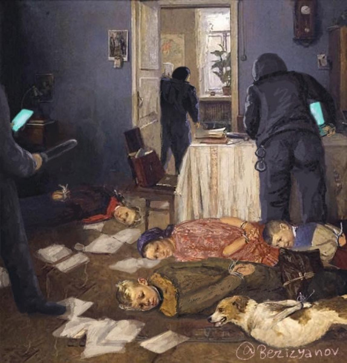
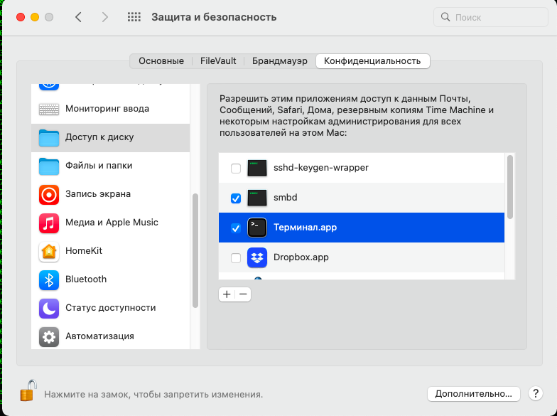
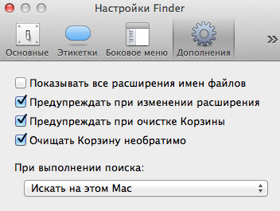
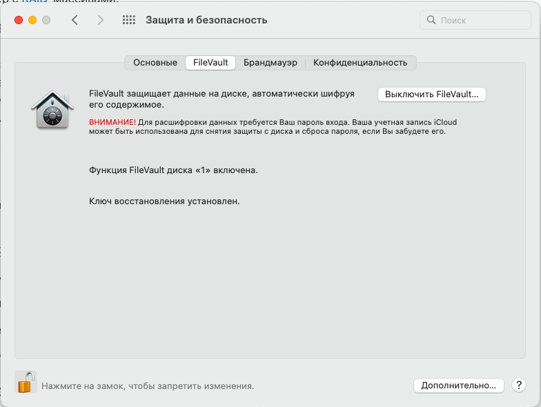

# EmergencyShutdown

##Emergency shutdown scripts for different operating systems

###https://github.com/bormaxi8080/EmergencyShutdown

## ЧТО ЭТО ТАКОЕ?

Это предназначено для экстренного выключения компьютера и пригодится, если вам нужно немедленно удалить все оперативные рабочие данные и выключить компьютер.

Например, в ситуации, когда к вам в квартиру с ордером на обыск стучатся сотрудники правоохранительных органов или другие неожиданные (или ожидаемые с минуту на минуту) неприятные гости, - и вот они уже режут ваши двери болгаркой, счет времени идет на минуты, и вы понимаете, что нужно срочно удалить критически важные данные с вашего рабочего компьютера.

Этот набор скриптов очищает все пользовательские данные во всех браузерах и популярных мессенджерах, в том числе сессии, сохраненные пароли и файлы cookie, и затем производит принудительное выключение компьютера.

## ЗАЧЕМ ЭТО НУЖНО?

Для того, чтобы ваши актуальные данные не попали "не в те" руки.

> В ситуации "сделаем это руками" это займет достаточно много времени, и вы просто не успеете.

В некоторых ситуациях это может привести к проблемам определенного рода, самая худшая из которых, помимо компрометации данных с вашего компьютера, потеря свободы. В России, Беларуси и некоторых других странах сейчас это крайне актуально.

## ПОЧЕМУ ИМЕННО ЭТО?

Потому, что это сделано на личном опыте.

И основной упор сделан на то, что это (по крайней мере, со временем и с помощью сообщества) будет работать крайне быстро и надежно.

То есть вам не надо будет иметь полчаса, когда к вам ломятся в двери, а удалить все данные с вашего компьютера безопасно и практически мгновенно можно будет буквально за полминуты.

## ВАЖНО!

> Разработка данного ПО еще не полностью закончена, поэтому для скриптов, в названии которых есть префикс "beta" мы рекомендуем сначала производить их запуск на тестовой виртуальной машине.

Запуск скриптов из этого репозитария может привести к необратимой потере ваших данных.
Поэтому перед настройкой, тестированием и запуском этого ПО обязательно убедитесь, что вы корректно настрили резервное копирование ваших данных!

> Для использвания этих скриптов необходимо понимание что именно они выполняют, ну или как минимум уровень владения компьютером не ниже "среднего по больнице". Если вы "рядовой пользователь" компьютера, пожалуйста, внимательно прочитайте инструкцию и по-возможности обратитесь к знакомым ИТ-специалистам.

В руках совсем неопытного пользователя данные скрипты могут попросту разрушить вашу систему, не принеся должного эффекта. Поэтому проконсультируйтесь с компетентными специалистами или с автором, задайте вопрос в комментариях, если данное ПО вызывает у вас сомнения или опасения по поводу его использования.

> Для тестирования работоспособности скриптов рекомендуется использовать виртуальную машину с конфугурацией, аналогичной вашей рабочей системе.

Более подробные рекомендации и советы по настройке вашего рабочего окружения смотрите ниже.

## СОДЕРЖАНИЕ

##**emergency-shutdown-mac-osx-beta.sh**

Beta-версия скрипта очистки пользовательских данных для Mac OS.

Скрипт производит очистку критически важных данных на вашем Mac и принудительно выключает компьютер.

> Скрипт предназначен только для запуска на MacOS X и не будет работать на других операционных системах.

**Что делает скрипт:**

- Закрывает открытые браузеры Google Chrome, Mozilla Firefox, Apple Safari.
- Очищает историю, кэш и сохраненные пароли браузеров Google Chrome, Mozilla Firefox, Apple Safari, удалят файлы cookies, сессии и сохраненные пароли.
- Очищает историю сообщений, сессии и сохраненные пароли в мессенджерах Telegram, Skype, Signal, Zoom, Discord.
- [TODO]: Удаляет с вашего Mac приложение WhatsApp, если оно установлено. История и сессия WhatsApp Web чистятся вместе с браузерами. 
- [TODO]: При необходимости полностью удаляет браузеры Google Chrome, Mozilla Firefox, Apple Safari, мессенджеры Telegram, WhatsApp, Skype, Signal, Zoom, Discord, приложения DropBox и Vera Crypt с вашего компьютера.
- [TODO]: (Настраивается) Полностью удаляет содержимое указанных вами папок.
- [TODO]: Безвозвратно удаляет некоторые приложения с вашего Mac и чистит их историю.
- Очищает историю вызыемых вами системных команд в terminal (bash, zsh).
- Очищает корзину.
- [Optional] Перезатирает свободное место на ваших дисках для исключения восстановления удаленных файлов специальными утилитами.
- Выключает компьютер.

> Важно: на MacOS все ваши данные удаляются БЕЗВОЗВРАТНО, без возможности восстановления. Более подробно про это можно почитать тут: https://appleinsider.ru/mac-os-x/kak-vospolzovatsya-propavshej-funkciej-diskovoj-utility.html

**Запуск:**

>sudo emergency-shutdown-mac-osx-beta.sh

Разрешения:

1. Для корректной работы рекомендуем дать права на доступ Terminal на все папки:

2. Рекомендуем предварительно отключить подтверждения на очиску корзины:

## НАШИ РЕКОМЕНАЦИИ ДЛЯ РАЗНЫХ ТИПОВ ОПЕРАЦИОННЫХ СИСТЕМ:

* Установите надежные пароли на вход в систему.
* Включите шифрование жесткого диска вашего компьютера (FileVault для MacOS)
  
* Включите функцию TRIM для SSD дисков (MacOS: https://ddr5.com.ua/kak-vklyuchit-trim-ssd-diskov-v-mac-os/).
* Установите DropBox или другое облачное приложение от НАДЕЖНОГО производителя для размещения рабочих документов в облаке.
Таким образом вы обеспечите безопасное резервное копирование и сохранность ваших данных и сможете безболезненно удалять и восстанавливать любые файлы и папки на вашем компьютере в произвольный момент времени.
* Предыдущее правило неприменимо к критически важным и чувствительным данным!
Храните уязвимые данные только в защищенных зашифрованных файловых контейнерах на зашифрованных дисках.
* Пользуйтесь зашифрованными файловыми контейнерами. Для этого мы рекомендуем установить специальное ПО, например VeraCrypt: https://veracrypt.ru/
* Не храните ваши данные в открытом виде на внешних дисках, флэшках или облачных сервисах!
* Храните ваши повседневные пароли (к почте, сайтам, сервисам) только в зашифрованном надежным паролем файловом контейнере. Это личное мнение, но популярным менеджерам паролей мы тоже не доверяем.
* На файловые контейнеры установите стойкие длинные пароли, которые будут известны только вам. Никому не говорите ваши пароли! Отдайте флэшку с криптоконтейнером с паролями надежному человеку (супругу, родителям) или хорошо спрячьте вне жилых или нежилых помещений, принадлежащих вам.
* Включите двухфакторную аутентификацию в мессенджерах.
* По возможности заранее удаляйте критически важные переписки в мессенджерах, которые могут вам потенциально навредить. Включите автоматическую очистку сообщений в мессенджерах по таймингу.
* По возможности не пользуйтесь российскими мессенджерами и соцсетями от ВКонтакте, Mail.ru, Одноклассники и пр.
* По возможности не пользуйтесь антивирусами от российских производителей (в первую очередь от Kasperksy).
> Товарищ Майор не дремлет!
* Включите автоматическую очистку корзины.
* Установите хороший VPN.
* Включите автоматическую блокировку вашего компьютера по таймеру, например, через 5 минут после того, ка на нем не производится никаких активных действий.
* По возможности не пользуйтесь любым другим российским и околороссийским софтом, критичным к сбору ваших данных (Яндекс.Бразуер, Mail.ru Agent, продукты Kaspersky, ВКонтакте, Одноклассники). Держите почту и файловые хранилища на зарубежных сервисах (Gmail, DropBox, GitHub и пр.).
* В случае передачи критически важной и опасной информацией пользуйтесь только одноразовыми сервисами (email, мессенджеры) и сразу же удаляйте все данные об их использовании. Также в этом случае не рекомендуем использовать операционные системы семейства Windows.

###Если к вам пришли с обыском, согласно 51 статье Конституции РФ по закону вы не обязаны свидетельствовать против себя, своих родсвенников и членов своей семьи, раскрывать содержимое своего компьютера и телефона, раскрывать тайну переписки и называть ваши пароли от компьютера, телефона, защищенных дисков и других устройств сотрудникам правоохранительных органов!

> Если вы уверены в корректной очистке вашего компьютера от всех чувствительных данных - можете назвать. На ваш страх и риск. Но мы рекомендуем все же этого не делать, по крайней мере без консультации с адвокатом.

Более развернутые инструкции что делать и как себя вести, если к вам пришли правоохранительные органы, находятся тут:

> https://legal.ovdinfo.org/obysk-doma#1

Специально для айтишников:

> https://habr.com/ru/company/unidata/blog/570118/

## ЛИЦЕНЗИЯ:

Свободная (BSD 3-Clause).

При распространении данного кода необходимо ссылаться на его автора и репозитарий в Git:

> ####https://github.com/bormaxi8080/EmergencyShutdown

## БЛАГОДАРНОСТИ И ДОНАТЫ:

Если данные скрипты будут вам полезны, авторы будут благодарны за донат. Это поможет поддерживать продукт в актуальном состоянии и развивать его в дальнейшем.

> Карта Tinkoff: 5536 9138 6607 4988

> Etherium: 0xe29685d6f0032bccac08b0e745a1a69ef9803973

## ДАЛЬНЕЙШЕЕ РАЗВИТИЕ ПРОДУКТА:

По вопросам написания аналогичного ПО для систем семейства Linux, Windows, iOS и Android обращайтесь по указанным ниже контактам.

Мы очень хотели бы, чтобы это ПО в дальнейшем стало в некотором роде "универсальным", обеспечивающим корректное и безопасное удаление ваших данных в случае критической ситуации, и хотели бы в дальнейшем развивать его. Если проект будет полезен сообществу и получит донаты, он будет активно развиваться.

В планах сделать то же самое для ОС семейства Linux, Windows, iOS и Android. И чтобы оно работало ДЕЙСТВИТЕЛЬНО БЫСТРО.

Мы очень приветствуем любые предложения по улучшению и переносу данного ПО на различные платформы, и поэтому будем очень рады коммитам и пулл-реквестам в наш пока еще маленький репозитарий.

## КОНТАКТЫ ДЛЯ СВЯЗИ С АВТОРАМИ:

https://www.facebook.com/bormaxi/

https://www.linkedin.com/in/i-maxi/

@maxim.goodjob@gmail.com

Telegram: @bormaxi

С уважением, Максим Борщев